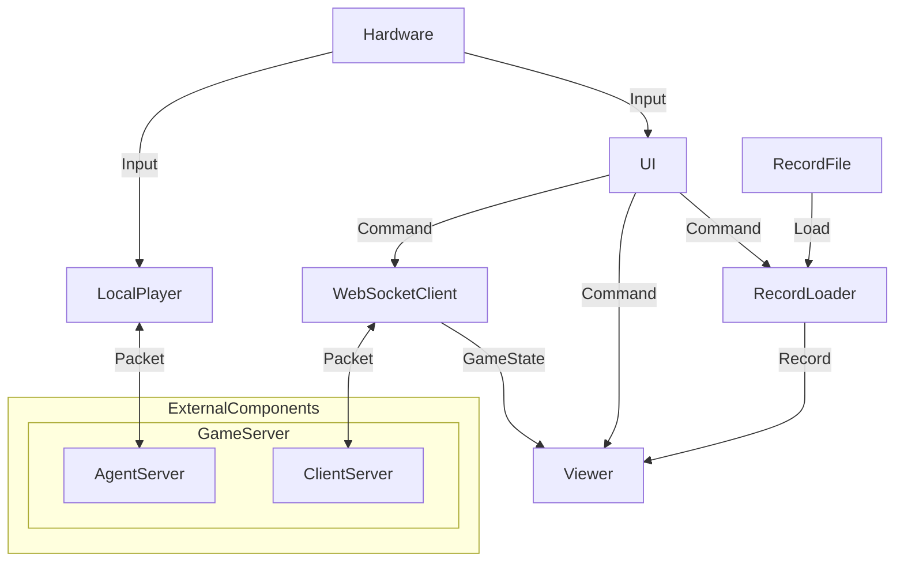

# THUAI7 游戏客户端

## 整体架构

```mermaid
graph
RecordLoader
Viewer
UI
WebSocketClient
Hardware
LocalPlayer
subgraph ExternalComponents
    subgraph GameServer
        AgentServer
        ClientServer
    end
end

RecordFile
Hardware
RecordFile --Load--> RecordLoader
Hardware --Input--> UI
Hardware --Input--> LocalPlayer
LocalPlayer <--Packet--> AgentServer
UI --Command--> RecordLoader
RecordLoader --Record--> Viewer
UI --Command--> Viewer
UI --Command--> WebSocketClient
WebSocketClient <--Packet--> ClientServer
WebSocketClient --GameState--> Viewer
```

## 组件

### UI

PENDING

### WebSocketClient

PENDING

### RecordLoader

PENDING

### Viewer

PENDING

### LocalPlayer

PENDING

## 开发人员

*以“组件名称：开发者”的格式写在此目录下。*
