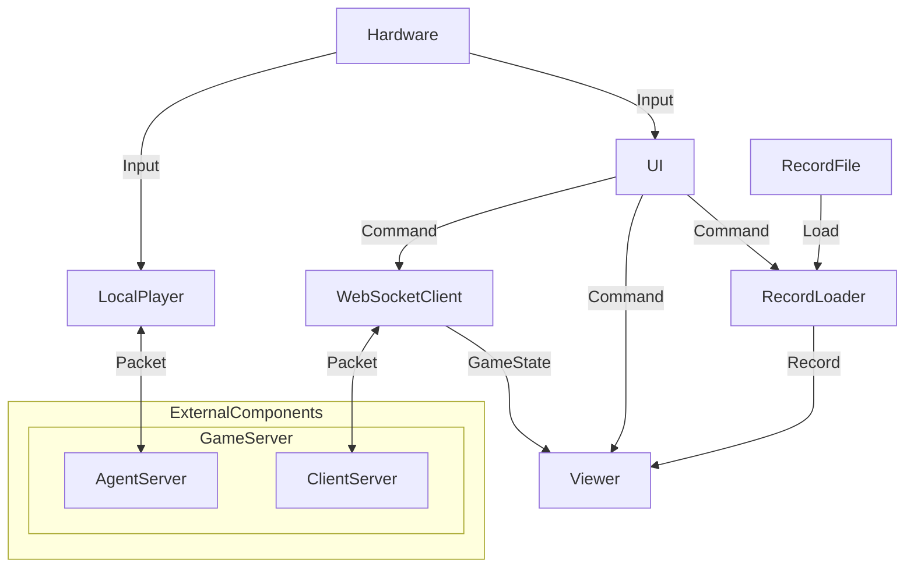

# THUAI7 游戏客户端

## 整体架构



## 组件

### UI

#### 属性

*如有需要，可添加、删除、修改。*

```csharp
```

#### 方法

*如有需要，可添加、删除、修改。*

```csharp
```

#### 事件

*如有需要，可添加、删除、修改。*

```csharp
```

### WebSocketClient

#### 属性

*如有需要，可添加、删除、修改。*

```csharp
```

#### 方法

*如有需要，可添加、删除、修改。*

```csharp
```

#### 事件

*如有需要，可添加、删除、修改。*

```csharp
```

### RecordLoader

#### 属性

*如有需要，可添加、删除、修改。*

```csharp
```

#### 方法

*如有需要，可添加、删除、修改。*

```csharp
```

#### 事件

*如有需要，可添加、删除、修改。*

```csharp
```

### Viewer

#### 属性

*如有需要，可添加、删除、修改。*

```csharp
```

#### 方法

*如有需要，可添加、删除、修改。*

```csharp
```

#### 事件

*如有需要，可添加、删除、修改。*

```csharp
```

### LocalPlayer

#### 属性

*如有需要，可添加、删除、修改。*

```csharp
```

#### 方法

*如有需要，可添加、删除、修改。*

```csharp
```

#### 事件

*如有需要，可添加、删除、修改。*

```csharp
```

## 开发人员

*以“组件名称：开发者”的格式写在此目录下。*
