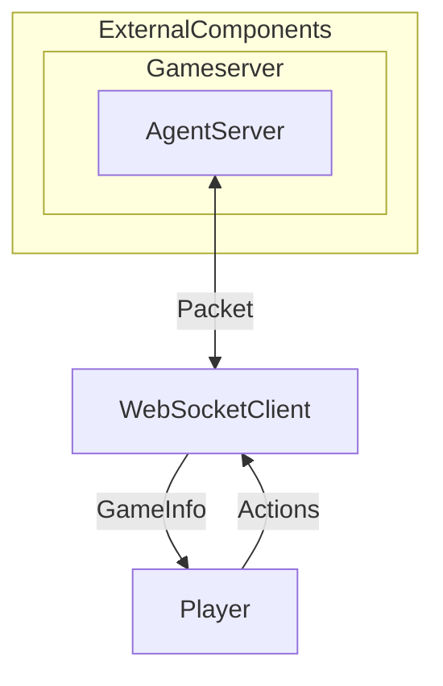

# THUAI7 游戏Sdk

## 整体架构

```mermaid
graph
subgraph ExternalComponents
    subgraph Gameserver
        AgentServer
    end
end
WebSocketClient

AgentServer <--Packet--> WebSocketClient
WebSocketClient --GameInfo --> Player
Player --Actions--> WebSocketClient
```

## 组件

### WebSocketClient

PENDING

### Player

PENDING

## 开发人员

*以“组件名称：开发者”的格式写在此目录下。*
