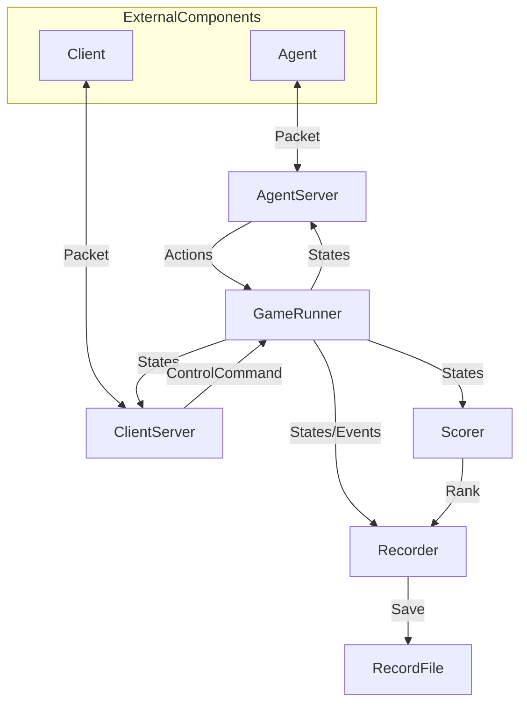

# THUAI7 游戏服务端

## 整体架构

```mermaid
graph TB
subgraph ExternalComponents
    Agent
    Client
end
AgentServer
ClientServer
GameRunner
Recorder
Scorer
RecordFile

Agent <--Packet--> AgentServer
Client <--Packet--> ClientServer
GameRunner --States/Events--> Recorder
GameRunner --States--> Scorer
Scorer --Rank--> Recorder
Recorder --Save--> RecordFile
GameRunner --States--> AgentServer
GameRunner --States--> ClientServer
AgentServer --Actions--> GameRunner
ClientServer --ControlCommand--> GameRunner
```

## 组件

### AgentServer

PENDING

### ClientServer

PENDING

### GameRunner

PENDING

### Scorer

PENDING

### Recorder

PENDING

## 开发人员

*以“组件名称：开发者”的格式写在此目录下。*
