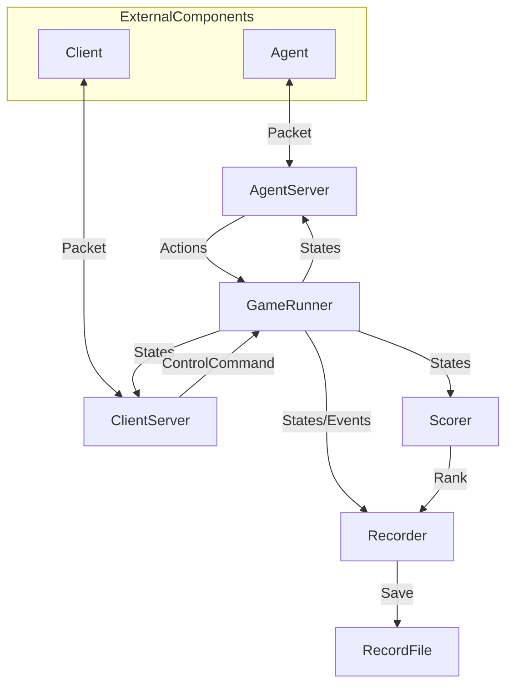

# THUAI7 游戏服务端

## 整体架构



## 组件

### AgentServer

#### 属性

*如有需要，可添加、删除、修改。*

```csharp
```

#### 方法

*如有需要，可添加、删除、修改。*

```csharp
```

#### 事件

*如有需要，可添加、删除、修改。*

```csharp
```

### ClientServer

#### 属性

*如有需要，可添加、删除、修改。*

```csharp
```

#### 方法

*如有需要，可添加、删除、修改。*

```csharp
```

#### 事件

*如有需要，可添加、删除、修改。*

```csharp
```

### GameRunner

#### 属性

*如有需要，可添加、删除、修改。*

```csharp
```

#### 方法

*如有需要，可添加、删除、修改。*

```csharp
```

#### 事件

*如有需要，可添加、删除、修改。*

```csharp
```

### Scorer

#### 属性

*如有需要，可添加、删除、修改。*

```csharp
```

#### 方法

*如有需要，可添加、删除、修改。*

```csharp
```

#### 事件

*如有需要，可添加、删除、修改。*

```csharp
```

### Recorder

#### 属性

*如有需要，可添加、删除、修改。*

```csharp
```

#### 方法

*如有需要，可添加、删除、修改。*

```csharp
```

#### 事件

*如有需要，可添加、删除、修改。*

```csharp
```

## 开发人员

*以“组件名称：开发者”的格式写在此目录下。*
